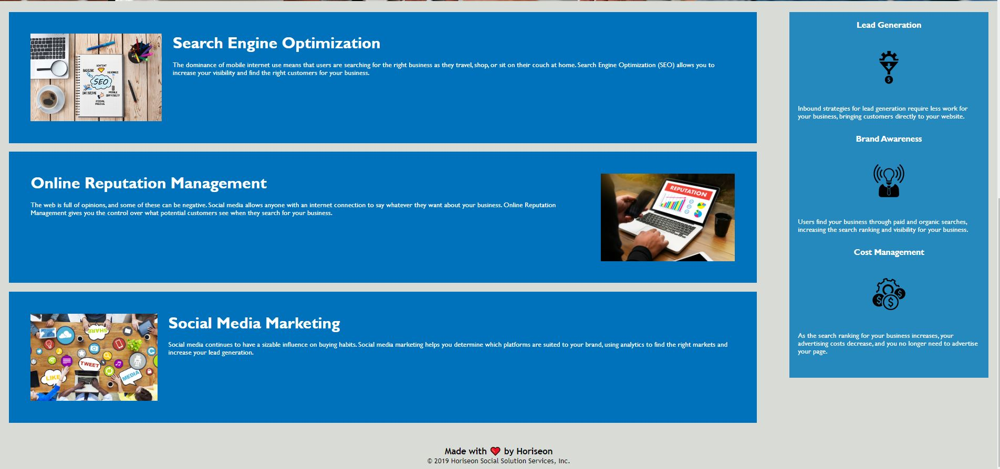

# Code Refactor Starter Code

## _Table Of Contents_

1. [Description](#description)
2. [Usage](#usage)
3. [Installation](#installation)
4. [License](#license)
5. [Criteria For Assignment](#criteria-for-assignment)
6. [Repo Link](#repository-link)
7. [Deployed Website](#deployed-website)
8. [Screen Shots](#screen-shots)

## Description

For this project we were given the code to a website. We were asked to refreactor the starter code and clean it up. After the code was refactored (taking out the divs and adding more clear lines of code that did not alter it.) the code was pushed to my github. The website was deployed via github and both github and the website link will be submitted for this project.

## Installation

You will not need to install any npms for this application.

## License

MIT

_Website for license_

[MIT License Website](https://mit-license.org/)

## Usage

This was good practice for refactoring code and deploying via github. Listed below were the tasks that we needed to accomplish.

## Criteria-for-assignment

GIVEN a webpage meets accessibility standards

**WHEN I view the source code**
*THEN I find semantic HTML elements*

**WHEN I view the structure of the HTML elements**
*THEN I find that the elements follow a logical structure independent of styling and positioning*

**WHEN I view the image elements**
*THEN I find accessible alt attributes*

**WHEN I view the heading attributes**
*THEN they fall in sequential order*

**WHEN I view the title element**
*THEN I find a concise, descriptive title*

## Repository-Link

[Repo Link](https://github.com/PintoDrop/urban-oct-homework)

## Deployed-Website

[Deployed Website](https://pintodrop.github.io/urban-oct-homework/)

## Screen-Shots

